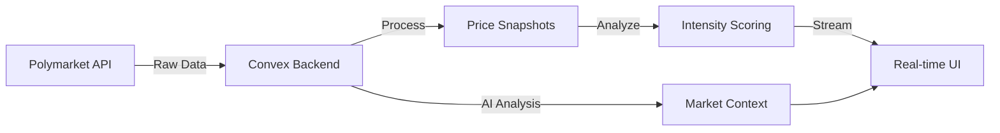

# 🌊 TREMOR.LIVE

> **Open-source prediction market monitoring**

Real-time detection of significant market movements across prediction markets. Community-maintained, transparent, and self-hostable.

<div align="center">
  
[](https://tremor.live)
[](https://github.com/sculptdotfun/tremor)
[](LICENSE)

</div>

## 🎯 What is TREMOR?

TREMOR monitors ~500 active prediction markets on Polymarket, detecting significant price movements in real-time. Each movement is scored on a 0-10 intensity scale:

- 🔴 **EXTREME (7.5+)**: Major market movements
- 🟠 **HIGH (5.0-7.5)**: Significant activity
- 🟡 **MODERATE (2.5-5.0)**: Notable changes
- ⚪ **LOW (0-2.5)**: Minor fluctuations

### Features

- Real-time monitoring of prediction markets
- Intensity scoring based on price movement and volume
- Multi-timeframe analysis (5min/1hr/24hr)
- Open-source and self-hostable
- Community-driven development

## 🚀 Quick Start

```bash
# Clone the repository
git clone https://github.com/sculptdotfun/tremor.git
cd tremor

# Install dependencies
pnpm install

# Set up environment variables
cp .env.example .env.local
# Add your Convex deployment URL

# Run development server
pnpm dev

# Open http://localhost:3000
```

## 📊 How It Works

### The Data Pipeline



### Intelligent Monitoring

TREMOR doesn't treat all markets equally:

| Market Type | Volume      | Sync Frequency   | Why                  |
| ----------- | ----------- | ---------------- | -------------------- |
| 🔥 **HOT**  | >$50k daily | Every 15 seconds | Where the action is  |
| 🌡️ **WARM** | $5k-50k     | Every minute     | Active but stable    |
| ❄️ **COLD** | <$5k        | Every 5 minutes  | Low activity markets |

### The Scoring Algorithm (v2)

Our intensity scoring maps price changes to seismic-like measurements:

```
Price Change → Intensity Score
1pp  → 1.0 (barely felt)
5pp  → 5.0 (moderate shake)
10pp → 7.5 (significant event)
20pp → 10.0 (maximum intensity)
```

With smart volume filtering:

- <$1,000 volume: No score (too small to matter)
- $1,000-10,000: Gradual amplification
- > $10,000: Full intensity scoring

## 🏗️ Architecture Highlights

### Tech Stack

- **Frontend**: Next.js 15 + React 19 + TypeScript
- **Backend**: Convex (reactive database + serverless)
- **Styling**: Tailwind CSS
- **Data Source**: Polymarket Gamma API
- **Deployment**: Vercel

### Key Features

- ⚡ Real-time updates via reactive queries
- 📈 Multi-timeframe analysis (5min/1hr/24hr)
- 🤖 AI-powered market explanations
- 📱 Responsive design for all devices
- 🔄 Automatic data retention management
- 📊 ~50k daily price snapshots processed

## 📁 Project Structure

```
tremor/
├── app/                    # Next.js app router
│   ├── components/        # React components
│   │   ├── Header.tsx    # Navigation
│   │   ├── Sidebar.tsx   # Filters & controls
│   │   ├── TremorCard.tsx # Market cards
│   │   └── ...
│   └── page.tsx          # Main dashboard
├── convex/               # Backend logic
│   ├── events.ts        # Event management
│   ├── markets.ts       # Market operations
│   ├── scores.ts        # Intensity calculations
│   └── crons.ts         # Scheduled tasks
├── docs/                # Documentation
└── lib/                 # Utilities
```

## 🎮 v0 Status & Roadmap

### Current Status (v0.1-alpha)

This is an early alpha release. We're live and processing real data, but expect:

- Occasional quirks in scoring edge cases
- UI polish opportunities
- Feature gaps we're actively filling

### Next Steps (v0.2)

- **Kalshi Integration** - Monitor both Polymarket and Kalshi
- **Better Sync** - Reduce latency with WebSocket connections
- **Notifications** - Get alerts for major movements
- **API Access** - Developer endpoints for market data

## 🤝 Contributing

We're building in public! Contributions welcome:

1. Fork the repository
2. Create your feature branch (`git checkout -b feature/AmazingFeature`)
3. Commit changes (`git commit -m 'Add AmazingFeature'`)
4. Push to branch (`git push origin feature/AmazingFeature`)
5. Open a Pull Request

See [CONTRIBUTING.md](docs/CONTRIBUTING.md) for details.

## 📖 Documentation

- [Deployment Guide](docs/DEPLOYMENT.md) - Get it running in production
- [Architecture](docs/ARCHITECTURE.md) - Technical deep dive
- [Scoring Algorithm](docs/SCORING.md) - How intensity is calculated
- [API Reference](docs/API.md) - Convex function documentation
- [Roadmap](docs/ROADMAP.md) - Where we're heading

## 📊 Live Stats

Currently monitoring:

- ~500 active prediction markets
- Processing ~50k price snapshots daily
- Computing ~1.4k intensity scores daily
- Serving real-time updates to all users

## 🙏 Acknowledgments

Built with:

- [Polymarket](https://polymarket.com) for market data
- [Convex](https://convex.dev) for the reactive backend
- [Vercel](https://vercel.com) for deployment
- Coffee ☕ and late nights 🌙

## 📝 License

MIT - see [LICENSE](LICENSE) file for details

---

<div align="center">

**[tremor.live](https://tremor.live)** | Built with 🌊 by the TREMOR team

_Detecting market earthquakes before they make headlines._

</div>
