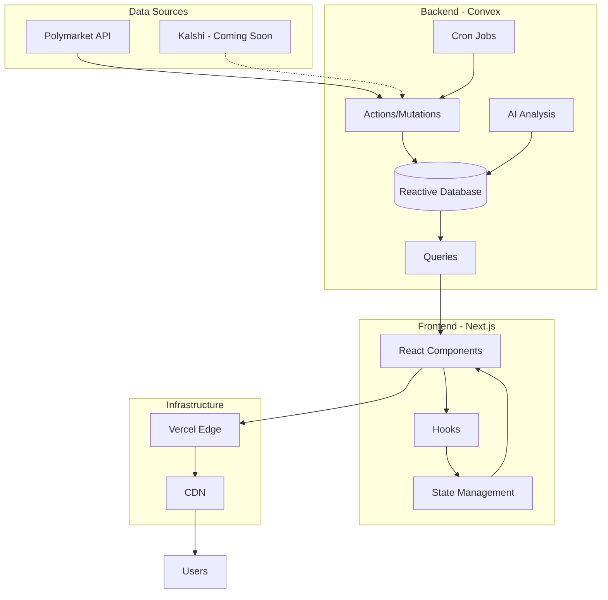

# 🏗️ TREMOR Architecture

> Deep dive into the technical implementation

## System Overview

TREMOR is built as a modern, real-time web application with a reactive backend and responsive frontend. The architecture prioritizes real-time data flow, scalability, and user experience.



## 🗄️ Data Layer

### Database Schema

#### Core Tables

```typescript
// events - Prediction market events
{
  _id: Id<"events">
  eventId: string       // Polymarket event ID
  title: string         // Human-readable title
  description?: string
  category?: string
  imageUrl?: string
  marketsCount: number
  totalVolume: number
  createdAt: number
  endDate?: string
  status: "active" | "resolved" | "inactive"
}

// markets - Individual YES/NO questions
{
  _id: Id<"markets">
  eventId: Id<"events">
  marketId: string      // Polymarket market ID
  question: string
  outcome: "Yes" | "No"
  currentPrice: number  // 0-1 probability
  volume24hr: number
  totalVolume: number
  lastTradeTime: number
  syncPriority: "hot" | "warm" | "cold"
}

// priceSnapshots - Time-series price data
{
  _id: Id<"priceSnapshots">
  marketId: Id<"markets">
  timestamp: number
  price: number         // Normalized 0-1
  volume: number
  tradeCount: number
}

// scores - Computed intensity scores
{
  _id: Id<"scores">
  eventId: Id<"events">
  timestamp: number
  score5m: number       // 5-minute window score
  score1h: number       // 1-hour window score
  score24h: number      // 24-hour window score
  maxScore: number      // Maximum of all windows
  topMarket: {
    marketId: string
    question: string
    priceChange: number
    currentPrice: number
  }
  metadata: {
    totalVolume: number
    avgVolume: number
    marketCount: number
  }
}
```

### Data Retention Policy

| Table           | Retention | Reason                              |
| --------------- | --------- | ----------------------------------- |
| Events          | Permanent | Core reference data                 |
| Markets         | Permanent | Market metadata                     |
| Price Snapshots | 26 hours  | Balance between history and storage |
| Scores          | 48 hours  | Recent tremor history               |
| AI Analysis     | 7 days    | Context for recent events           |

## ⚡ Real-time Processing

### Sync Priority System

```typescript
// Market categorization logic
function determineSyncPriority(market: Market): SyncPriority {
  const volume24hr = market.volume24hr || 0;

  if (volume24hr > 50000) return 'hot'; // >$50k
  if (volume24hr > 5000) return 'warm'; // $5k-50k
  return 'cold'; // <$5k
}
```

### Cron Job Schedule

```typescript
// convex/crons.ts
export default cronJobs<DataModel>({
  // Event discovery
  'sync events': {
    schedule: '*/2 * * * *', // Every 2 minutes
    handler: 'actions:syncEvents',
  },

  // Market data sync
  'sync hot markets': {
    schedule: '*/15 * * * * *', // Every 15 seconds
    handler: 'actions:syncHotMarketTrades',
  },

  'sync warm markets': {
    schedule: '* * * * *', // Every minute
    handler: 'actions:syncWarmMarketTrades',
  },

  'sync cold markets': {
    schedule: '*/5 * * * *', // Every 5 minutes
    handler: 'actions:syncColdMarketTrades',
  },

  // Scoring computation
  'compute scores': {
    schedule: '* * * * *', // Every minute
    handler: 'mutations:computeScores',
  },

  // Maintenance
  'cleanup old data': {
    schedule: '0 3 * * *', // Daily at 3 AM UTC
    handler: 'mutations:cleanupOldData',
  },
});
```

## 🧮 Scoring Algorithm

### Intensity Calculation (v2)

```typescript
function calculateIntensity(
  priceChange: number, // Absolute price change
  volume: number // Trading volume
): number {
  // Base score from price movement
  let baseScore: number;

  if (priceChange <= 0.01)
    baseScore = priceChange * 100; // Linear 0-1
  else if (priceChange <= 0.05)
    baseScore = 1 + (priceChange - 0.01) * 100; // Linear 1-5
  else if (priceChange <= 0.1)
    baseScore = 5 + (priceChange - 0.05) * 50; // Linear 5-7.5
  else if (priceChange <= 0.2)
    baseScore = 7.5 + (priceChange - 0.1) * 25; // Linear 7.5-10
  else baseScore = 10; // Cap at 10

  // Volume multiplier
  let volumeMultiplier: number;

  if (volume < 1000)
    volumeMultiplier = 0; // Too small
  else if (volume < 10000)
    volumeMultiplier = volume / 10000; // Gradual
  else volumeMultiplier = 1; // Full score

  return baseScore * volumeMultiplier;
}
```

### Multi-window Analysis

```typescript
// Compute scores for different time windows
async function computeScoresForEvent(event: Event) {
  const now = Date.now();

  const windows = [
    { name: '5m', duration: 5 * 60 * 1000 },
    { name: '1h', duration: 60 * 60 * 1000 },
    { name: '24h', duration: 24 * 60 * 60 * 1000 },
  ];

  const scores = {};

  for (const window of windows) {
    const startTime = now - window.duration;
    const priceData = await getSnapshotsInRange(startTime, now);

    // Calculate max price change in window
    const maxChange = calculateMaxPriceChange(priceData);
    const avgVolume = calculateAverageVolume(priceData);

    scores[window.name] = calculateIntensity(maxChange, avgVolume);
  }

  return scores;
}
```

## 🎨 Frontend Architecture

### Component Hierarchy

```
App
├── Layout
│   ├── Header
│   └── Sidebar
│       ├── TimeWindowFilter
│       ├── IntensityFilter
│       └── MarketSummary
├── Dashboard
│   ├── TremorGrid
│   │   └── TremorCard[]
│   │       ├── IntensityIndicator
│   │       ├── MarketInfo
│   │       └── MagnitudeBar
│   └── TremorDetailPanel
│       ├── PriceChart
│       ├── MarketStats
│       └── AIAnalysis
└── OnboardingModal
```

### State Management

```typescript
// Using React Context for global state
interface AppState {
  timeWindow: '5m' | '1h' | '24h';
  intensityFilter: IntensityLevel[];
  selectedTremor: TremorData | null;
  isLoading: boolean;
}

// Convex reactive queries
const tremors = useQuery(api.scores.getLatestScores, {
  timeWindow,
  intensityFilter,
  limit: 50,
});
```

### Performance Optimizations

1. **Lazy Loading**: Images loaded on demand
2. **Virtualization**: Large lists rendered efficiently
3. **Memoization**: Expensive computations cached
4. **Code Splitting**: Routes loaded as needed
5. **Suspense Boundaries**: Graceful loading states

## 🔄 Data Flow

### Real-time Updates

```typescript
// Convex reactive pattern
export const getLatestScores = query({
  args: {
    timeWindow: v.string(),
    limit: v.number()
  },
  handler: async (ctx, args) => {
    // Query is reactive - updates automatically
    const scores = await ctx.db
      .query("scores")
      .order("desc")
      .take(args.limit);

    // Enrich with market data
    return Promise.all(scores.map(enrichScore));
  }
});

// Frontend consumption
function TremorDashboard() {
  // Automatically re-renders on data change
  const scores = useQuery(api.scores.getLatestScores);

  return <TremorGrid tremors={scores} />;
}
```

## 🤖 AI Integration

### Market Analysis Pipeline

```typescript
async function analyzeMarketMovement(
  event: Event,
  priceChange: number,
  volume: number
) {
  const prompt = `
    Analyze this prediction market movement:
    Event: ${event.title}
    Price Change: ${priceChange}%
    Volume: $${volume}
    
    Provide a brief, newsworthy explanation.
  `;

  const analysis = await openai.complete(prompt);

  await storeAnalysis({
    eventId: event._id,
    analysis,
    timestamp: Date.now(),
  });
}
```

## 🚦 Error Handling

### Graceful Degradation

```typescript
// API failures
try {
  const data = await fetchPolymarketData();
} catch (error) {
  // Log error
  console.error("Polymarket sync failed:", error);

  // Use cached data
  return getCachedData();

  // Retry with exponential backoff
  scheduleRetry(attemptNumber);
}

// Frontend error boundaries
<ErrorBoundary fallback={<ErrorFallback />}>
  <TremorDashboard />
</ErrorBoundary>
```

## 📊 Monitoring & Observability

### Key Metrics

- **Data Freshness**: Time since last sync
- **Score Computation Time**: Processing latency
- **API Response Times**: External service performance
- **Error Rates**: Failed syncs, computations
- **User Engagement**: Active users, page views

### Health Checks

```typescript
// System health endpoint
export const healthCheck = query({
  handler: async (ctx) => {
    const checks = {
      database: await checkDatabase(ctx),
      syncStatus: await checkLastSync(ctx),
      scoreComputation: await checkScoring(ctx),
      dataRetention: await checkCleanup(ctx),
    };

    return {
      status: allHealthy(checks) ? 'healthy' : 'degraded',
      checks,
    };
  },
});
```

## 🔐 Security Considerations

### Best Practices

1. **Input Validation**: All user inputs sanitized
2. **Rate Limiting**: Prevent abuse
3. **CORS Configuration**: Proper origin controls
4. **Environment Variables**: Secrets never in code
5. **Content Security Policy**: XSS protection
6. **HTTPS Only**: Encrypted connections

## 🚀 Deployment Architecture

### Production Setup

```
┌─────────────────┐     ┌─────────────────┐
│                 │     │                 │
│   Vercel Edge   │────▶│  Convex Cloud   │
│   (Frontend)    │     │   (Backend)     │
│                 │     │                 │
└─────────────────┘     └─────────────────┘
         │                       │
         ▼                       ▼
┌─────────────────┐     ┌─────────────────┐
│                 │     │                 │
│   Global CDN    │     │  Polymarket API │
│                 │     │                 │
└─────────────────┘     └─────────────────┘
```

### Scaling Strategy

- **Horizontal**: Add more Convex compute
- **Vertical**: Increase function memory/timeout
- **Geographic**: Multi-region deployment
- **Caching**: Edge caching for static assets

---

_For implementation details, see the source code in `/convex` and `/app` directories._
