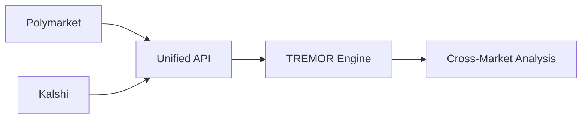

# 🗺️ TREMOR Roadmap

> From v0 proof-of-concept to production platform

## 📍 Current Status: v0.1-alpha

### What We've Built

✅ Real-time Polymarket monitoring  
✅ Intensity scoring algorithm (v2)  
✅ Multi-timeframe analysis  
✅ Reactive UI with live updates  
✅ Smart sync prioritization  
✅ Basic AI market analysis  
✅ Data retention management

### Known Limitations

- Single data source (Polymarket only)
- No user accounts or personalization
- Limited historical analysis
- No mobile app
- Basic alerting capabilities
- Manual deployment process

## 🚀 Next Steps (v0.2 - Q1 2025)

### 🎲 Kalshi Integration

**Timeline**: 2-3 weeks

**Features**:

- Dual-market monitoring
- Price divergence detection
- Arbitrage opportunity alerts
- Unified intensity scoring
- Market correlation analysis

**Technical Tasks**:

- [ ] Kalshi API integration
- [ ] Unified market model
- [ ] Cross-platform price normalization
- [ ] Arbitrage detection algorithm
- [ ] UI for multi-source display

### 📊 Enhanced Data Sync

**Timeline**: 3-4 weeks

**Improvements**:

- WebSocket connections for instant updates
- Reduced latency to <100ms
- Historical data backfill (90 days)
- Custom sync schedules per user
- Failover data sources

**Technical Tasks**:

- [ ] WebSocket infrastructure
- [ ] Message queue implementation
- [ ] Historical data pipeline
- [ ] Redundancy system
- [ ] Performance monitoring

### 🏆 Scoring Algorithm v3

**Timeline**: 4-5 weeks

**New Capabilities**:

- ML-based intensity prediction
- Pattern recognition
- Sentiment correlation
- Social signal integration
- Custom scoring profiles

**Technical Tasks**:

- [ ] Training data collection
- [ ] Model development
- [ ] A/B testing framework
- [ ] Performance benchmarking
- [ ] User feedback integration

## 🎯 Medium Term (v0.5 - Q2 2025)

### 🔔 Smart Notifications

**Push Alerts**:

- Extreme tremors (7.5+)
- Watched markets
- Custom thresholds
- Pattern matches

**Delivery Channels**:

- Browser notifications
- Email digests
- SMS (premium)
- Telegram bot
- Discord integration
- Webhook API

### 👤 User Accounts

**Features**:

- Watchlists
- Custom alerts
- Historical tracking
- Performance analytics
- Saved filters
- API access

### 📱 Mobile Experience

**Native Apps**:

- iOS app (React Native)
- Android app
- Push notifications
- Offline support
- Widget support

### 🤖 Advanced AI

**Capabilities**:

- Natural language queries
- Predictive analytics
- Anomaly detection
- Trend forecasting
- Automated insights

## 🌟 Long Term Vision (v1.0 - Q3/Q4 2025)

### 🌐 Multi-Platform Expansion

**Additional Sources**:

- Metaculus integration
- Manifold Markets
- PredictIt
- Sports betting markets
- Financial derivatives

### 💼 TREMOR Pro

**Premium Features**:

- Advanced analytics
- Custom algorithms
- API access
- Priority data
- Team collaboration
- White-label options

### 🛠️ Developer Platform

**API & Tools**:

- RESTful API
- WebSocket streams
- SDKs (Python, JS, Go)
- Webhooks
- Custom indicators
- Backtesting tools

### 📊 Analytics Suite

**Deep Insights**:

- Market maker analysis
- Whale tracking
- Correlation matrices
- Volatility indicators
- Prediction accuracy
- ROI tracking

## 🔬 Experimental Features

### Under Consideration

**🎮 Gamification**

- Prediction tournaments
- Accuracy leaderboards
- Achievement system

**🔗 Blockchain Integration**

- On-chain verification
- Decentralized data
- NFT alerts

**🧠 Advanced ML**

- GPT-powered analysis
- Computer vision for charts
- Audio market updates

## 📈 Success Metrics

### v0.2 Targets

- 1,000+ daily active users
- <1s page load time
- 99.9% uptime
- 1,000+ markets tracked
- 5-star Chrome extension

### v0.5 Targets

- 10,000+ registered users
- 100+ premium subscribers
- 1M+ API calls/month
- 5+ data sources
- Mobile app ratings 4.5+

### v1.0 Goals

- 100,000+ users
- 1,000+ premium subscribers
- $10k+ MRR
- Industry recognition
- Acquisition interest

## 🏗️ Technical Debt & Refactoring

### Priority Improvements

**Performance**:

- [ ] Query optimization
- [ ] Caching layer
- [ ] CDN implementation
- [ ] Database sharding

**Code Quality**:

- [ ] Test coverage >80%
- [ ] TypeScript strict mode
- [ ] Error tracking
- [ ] Performance monitoring

**DevOps**:

- [ ] CI/CD pipeline
- [ ] Automated testing
- [ ] Blue-green deployments
- [ ] Infrastructure as code

## 🤝 Community & Open Source

### Planned Initiatives

**Open Source Components**:

- Scoring algorithm library
- Market data normalizer
- Visualization components
- Example integrations

**Community Building**:

- Discord server
- Developer forum
- Bug bounty program
- Contributor rewards
- Educational content

## 💡 Feature Requests & Ideas

We're actively collecting feedback! Current user requests:

1. **CSV export** for historical data
2. **Dark/light theme** toggle
3. **Embedding widgets** for blogs
4. **RSS feeds** for tremors
5. **Slack integration** for teams
6. **Custom time ranges** beyond 24h
7. **Market categories** filtering
8. **Saved searches** and filters
9. **Multi-language** support
10. **Accessibility** improvements

## 📅 Release Schedule

| Version | Target Date | Focus                    |
| ------- | ----------- | ------------------------ |
| v0.1    | ✅ Jan 2025 | MVP Launch               |
| v0.2    | Feb 2025    | Kalshi + Better Sync     |
| v0.3    | Mar 2025    | Notifications + Accounts |
| v0.4    | Apr 2025    | Mobile Web + AI          |
| v0.5    | May 2025    | Native Apps              |
| v0.6    | Jun 2025    | Pro Features             |
| v0.7    | Jul 2025    | API Platform             |
| v0.8    | Aug 2025    | Multi-source             |
| v0.9    | Sep 2025    | Analytics Suite          |
| v1.0    | Oct 2025    | Production Ready         |

## 🚦 How to Contribute

1. **Report bugs** - GitHub issues
2. **Request features** - Discord community
3. **Submit PRs** - Check CONTRIBUTING.md
4. **Share feedback** - feedback@tremor.live
5. **Spread the word** - Tell your friends!

---

_This roadmap is a living document. Priorities may shift based on user feedback and market conditions._

**Last Updated**: January 2025  
**Status**: Actively Maintained  
**Feedback**: roadmap@tremor.live
